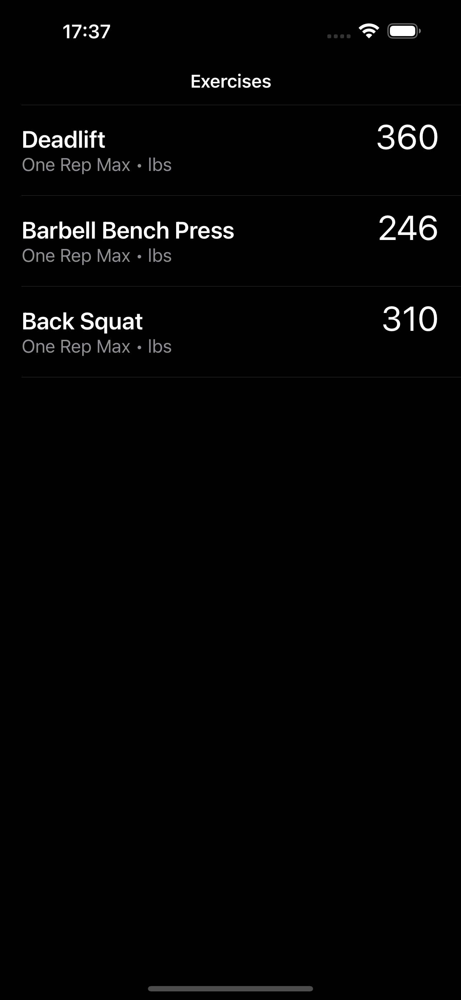
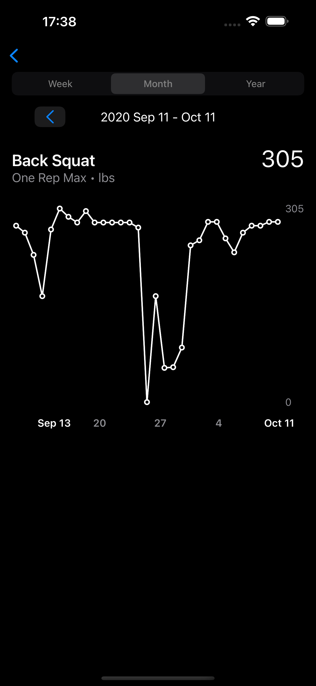
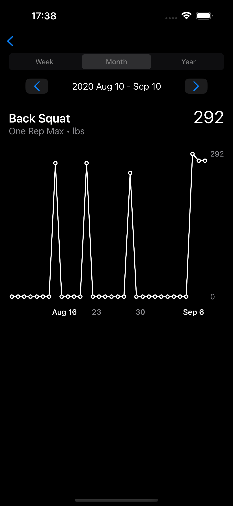

# Workout PR Tracker

OneRepMaxChart is a SwiftUI app designed to help users track their workout progress by calculating theoretical one-rep max (1RM) for each exercise and visualizing historical pattern of the user’s one-rep max data using Swift Charts.

## Tech Stack
- Languages: Swift
- Frameworks: SwiftUI, Swift Charts

## Architecture & Design Patterns
- MVVM
- Repository pattern

## Features
### Calculate Theoretical 1RM
Uses the [Brzycki Formula](https://en.wikipedia.org/wiki/One-repetition_maximum)

### Display Overall PR
Shows the maximum one-rep max achieved for each exercise across all workout days.

### Plot Historical PR Data
Visualizes monthly PR data using charts with support for backward and forward navigation. 

- Displays the maximum PR across monthly workout days.
- Weekly and yearly plots are out of scope.

### Support Dark mode

### Unit Tests
No unit tests were written, but the code is designed to be unit-testable.

### Platform Support
Supports iOS 16.0 and above.

### Dev Tools:
Built with Xcode 15.4.

## Screenshots

